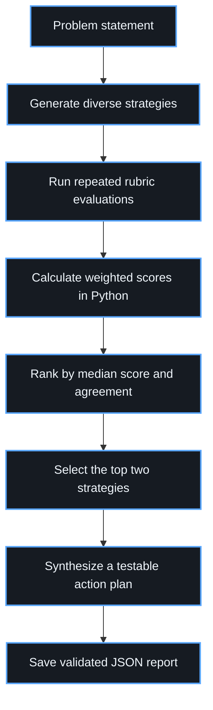

# Multi-Branch AI Strategy Engine


A production-oriented Python workflow that uses Gemini to generate multiple strategic approaches, evaluate them through repeated rubric-based reviews, rank them with deterministic scoring, and synthesize the strongest ideas into a practical implementation plan.

This project demonstrates structured LLM orchestration, schema validation, asynchronous API calls, retry controls, deterministic scoring, and machine-readable reporting.

## Why this project exists

A single model response can be plausible but incomplete, overly confident, or anchored to its first idea. This engine reduces that risk by separating solution generation from evaluation and synthesis:



## Key features

- Generates 2-5 strategies from deliberately different perspectives.
- Evaluates every strategy multiple times to reduce single-run variance.
- Uses Pydantic schemas for validated structured output.
- Calculates weighted scores locally instead of trusting model arithmetic.
- Ranks candidates by median score, with judge agreement as the tie-breaker.
- Combines compatible strengths from the two highest-ranked strategies.
- Produces implementation steps, deliverables, acceptance tests, failure controls, success metrics, and a 72-hour action plan.
- Executes independent evaluations asynchronously with bounded concurrency.
- Retries transient API, network, and validation failures with exponential backoff and jitter.
- Cancels stalled API calls with per-request and whole-workflow timeouts.
- Saves the full decision trail as JSON.

## Architecture

The workflow has four layers:

1. **Generation** - create distinct strategies for speed, reliability, cost, scalability, or risk control.
2. **Evaluation** - score feasibility, scalability, risk mitigation, expected impact, and evidence quality.
3. **Ranking** - calculate deterministic weighted scores and measure disagreement between evaluation runs.
4. **Synthesis** - use the winner as the backbone and selectively incorporate compatible strengths from the runner-up.

The default scoring weights are:

| Criterion | Weight |
|---|---:|
| Feasibility | 25% |
| Scalability | 15% |
| Risk mitigation | 25% |
| Expected impact | 25% |
| Evidence quality | 10% |

## Project structure

```text
multi-branch-ai-strategy-engine/
├── README.md
├── CHANGELOG.md
├── LICENSE
├── requirements.txt
├── pyproject.toml
├── .env.example
├── .gitignore
├── src/
│   └── strategy_engine.py
├── tests/
│   ├── test_ranking.py
│   ├── test_scoring.py
│   ├── test_timeouts.py
│   └── test_validation.py
├── examples/
│   ├── image_qa_problem.txt
│   ├── sample_report.json
│   └── sample_terminal_output.txt
└── docs/
    └── architecture.md
```

## Requirements

- Python 3.11 or newer
- Gemini API key

## Installation

```bash
git clone https://github.com/danial-soltani/multi-branch-ai-strategy-engine.git
cd multi-branch-ai-strategy-engine

python -m venv .venv
```

Activate the environment:

```bash
# Linux/macOS
source .venv/bin/activate

# Windows PowerShell
.venv\Scripts\Activate.ps1
```

Install dependencies:

```bash
python -m pip install -r requirements.txt
```

## Configuration

Copy `.env.example` or set the environment variables manually. Never commit a real API key.

```bash
# Linux/macOS
export GEMINI_API_KEY="your_api_key"

# Windows PowerShell
$env:GEMINI_API_KEY="your_api_key"
```

The model can be overridden without editing the code:

```bash
export GEMINI_MODEL="your_model_id"
```

## Usage

Run the included default image-QA problem:

```bash
python src/strategy_engine.py
```

Run a custom problem:

```bash
python src/strategy_engine.py \
  "How can a solar installer automate customer progress updates?"
```

Tune quality, speed, and cost:

```bash
python src/strategy_engine.py \
  "Your problem statement" \
  --branches 4 \
  --judges 2 \
  --concurrency 4 \
  --request-timeout 60 \
  --workflow-timeout 600 \
  --output result.json
```

### Practical presets

Fast and inexpensive:

```bash
python src/strategy_engine.py "Your problem" --branches 3 --judges 1
```

Balanced:

```bash
python src/strategy_engine.py "Your problem" --branches 4 --judges 2
```

More robust evaluation:

```bash
python src/strategy_engine.py "Your problem" --branches 5 --judges 3
```

## Example output

The repository includes a compact illustrative report in [`examples/sample_report.json`](examples/sample_report.json). A real run stores:

- every generated approach;
- every evaluator score and rationale;
- median weighted score and score spread;
- final ranking;
- synthesized implementation plan;
- acceptance tests, failure controls, and success metrics.

Example terminal summary:

```text
1. Identity Embedding Gate | median=8.55/10 | judge spread=0.20
2. Multi-Angle Reference Pack | median=8.20/10 | judge spread=0.35
3. Regenerate-on-Failure Loop | median=7.65/10 | judge spread=0.50

Identity-Consistency QA Pipeline
Build a reference-driven generation workflow with automated identity checks...
```

## Testing

The core scoring, validation, and ranking behavior can be tested without an API key:

```bash
python -m pytest
```

The tests cover:

- deterministic weighted scoring;
- rejection of out-of-range scores;
- rejection of unexpected schema fields;
- median-score ranking;
- judge-agreement tie-breaking;
- cancellation of stalled operations at their deadline;
- runtime configuration defaults.

## Design decisions

### Why use multiple evaluations?

Repeated evaluations reduce reliance on one stochastic judgment. They are separate runs of the configured model, not independent human experts or independent model families.

### Why calculate scores in Python?

The model supplies criterion-level judgments. Python performs the weighted arithmetic, making ranking transparent and reproducible.

### Why combine the top two?

Winner-takes-all selection can discard a useful mechanism from the runner-up. The synthesis step keeps the winner as the backbone and includes only compatible strengths from second place.

## Limitations

- Model-generated evaluations are advisory and may still contain bias or error.
- Repeated evaluations use the same configured model by default.
- More branches and judges increase latency and API usage.
- High-stakes decisions require domain-expert review and independent evidence.
- This is a multi-branch generate-evaluate-synthesize engine, not a full multi-depth Tree-of-Thoughts search with recursive expansion, pruning, and backtracking.
- The sample report is illustrative so the repository can be reviewed without an API key.

## Security

- Never commit `.env` or a real API key.
- Treat problem statements and generated reports as potentially sensitive.
- Review retention and privacy requirements before using confidential client data with any external model API.

## Portfolio summary

> Built a Python-based AI strategy engine that avoids relying on a single model response. It generates diverse approaches, evaluates each through repeated rubric-based assessments, performs deterministic weighted ranking, and combines the strongest ideas into a validated implementation plan. The system includes structured outputs, asynchronous execution, retries, CLI configuration, automated tests, and JSON reporting.

## License

MIT License. See [`LICENSE`](LICENSE).
